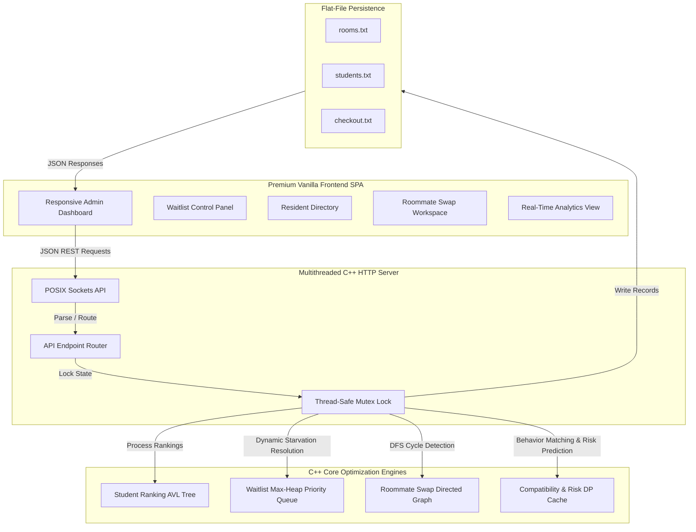

<div align="center">

# 🏢 Staywise – Smart Campus Hostel ERP System
### *Enterprise-Grade Algorithmic Resource Planning & Accommodation Management Platform*

[](https://isocpp.org/)
[](https://developer.mozilla.org/en-US/docs/Web/JavaScript)
[](https://developer.mozilla.org/en-US/docs/Web/CSS)
[](https://apple.com/)

**Staywise** is a high-performance, real-time campus accommodation management ERP. Built on a custom multithreaded C++ socket server and a dark-themed premium vanilla frontend, Staywise implements advanced computer science data structures and optimization algorithms to solve critical constraint-satisfaction problems in student housing.

</div>

---

## 📖 Project Overview
Staywise moves far beyond simple CRUD (Create, Read, Update, Delete) database applications. It is an algorithmic resource-planning platform that manages roommate compatibility matching, dynamic prioritization of waitlists, cyclic roommate swap path detection, and academic lifecycle checkouts. By running directly in-memory using custom self-balancing binary search trees, custom heap structures, and directed graphs, Staywise guarantees sub-millisecond execution times even during massive batch allocations.

---

## 🚨 Real-World Problem Solved
Campus housing management is plagued by several core operational friction points:
1. **Roommate Disputes**: Caused by assigning students with conflicting behavioral habits (e.g., mismatched sleeping schedules, cleanliness standards, or study preferences).
2. **Dynamic Waitlist Inefficiency**: Manually sorting waitlists after room cancellations is prone to human bias and administrative delay.
3. **No-Show Bed Wastage**: Rooms remaining empty due to dropouts or delayed arrivals, causing loss of capacity.
4. **Cyclic Swap Requests**: Students desiring room transfers often form complex dependency loops (Student A $\rightarrow$ Room B, Student B $\rightarrow$ Room C, Student C $\rightarrow$ Room A) that administrators cannot manually resolve.
5. **Academic Cohort Transitions**: Processing term end checkouts requires validating academic parameters (CGPA, backlogs, exams passed) rather than just age or seniority, ensuring struggling students are not unhoused while graduating students vacate beds promptly.

Staywise resolves these problems with a unified, constraint-satisfaction decision engine.

---

## 🏗️ System Architecture



### 1. Frontend Architecture & UI Modules
The frontend is built as a highly responsive, premium dark-themed Single Page Application (SPA). It uses curated color palettes (deep charcoal backgrounds, glassmorphism, accent warnings, success indicators) and micro-animations to deliver an executive-level administration portal. Key modules include:

*   **Resident Registry & Intake**: A comprehensive registration form with active client-side validations, capturing student identity, year of study, habits (sleep, cleanliness, study), AC/Non-AC preference, and exact preferred rooms.
*   **Waitlist Hub**: A real-time rendering of the Max-Heap queue showing the priority rank of every waiting student. Features include sorting, filtering (by risk level, category, gender), and starvation-prevention toggles.
*   **Graduation Checkout Workspace**: A dedicated operational module designed to check out and vacate graduated final-year cohorts safely, while immediately refilling beds from the waitlist.
*   **Cycle Swap Workspace**: An administrative interface where swap requests between two students are entered. The system checks gender compatibility and runs multi-node DFS cycles to execute swaps.
*   **Analytics Control Deck**: Displays instant occupancy ratios, average compatibility metrics, successful swaps, and total capacity stats in real-time.

### 2. Backend Architecture & Services
The C++ backend utilizes raw POSIX network sockets to build a **custom HTTP Web Server** from scratch. 
*   **High Performance Socket Loop**: Binds to port `8080` using `<sys/socket.h>` and utilizes a multi-threaded connection-handling routine (`std::thread`) to process requests asynchronously.
*   **Thread Safety**: A global `std::mutex dataMutex` locks all write actions, preventing race conditions on in-memory data structures during concurrent operations.
*   **No Heavy Frameworks**: Pure standard library implementation ensures minimal binary size, zero dependencies, and instantaneous startup.
*   **Flat-File DB Engine**: Reads and writes records dynamically to `sample_data/rooms.txt`, `sample_data/students.txt`, and generates logs to `checkout.txt`.

---

## ⚙️ Core Modules & Functional Responsibilities

To enforce administrative modularity and prevent accidental full-system reshuffles, the ERP separates tasks into strict functional APIs:

```
+-----------------------------------------------------------------------------------+
|                                  STAYWISE ERP                                     |
+-----------------------------------------------------------------------------------+
|                                                                                   |
|  [Register Resident]  ======> Validates & registers profile. Directly allocates   |
|                               ONLY if exact preferred room is vacant.            |
|                               Otherwise, pushes student to the waitlist queue.    |
|                                                                                   |
|  [Run Smart Allocation] ====> Global batch engine. Processes waitlist, checks     |
|                               roommate compatibility, evaluates upgrade rules,    |
|                               and optimizes housing globally.                     |
|                                                                                   |
|  [Recover Vacancies]  ======> Garbage collection. Scans for high-risk no-shows    |
|                               (distance & history DP), vacates them to waitlist,  |
|                               and refuels beds from waitlist.                     |
|                                                                                   |
|  [Graduate Checkout]  ======> Scans all students. Checks out eligible graduates   |
|                               (Sem >= 8, exam passed, no backlog, no extension),  |
|                               frees rooms, and runs vacancy recovery.             |
|                                                                                   |
|  [Assign Room]        ======> Admin manual override. Directly bypasses algorithms  |
|                               to place a student in a specific room.              |
|                                                                                   |
+-----------------------------------------------------------------------------------+
```

### 1. Register Resident
*   **Endpoint**: `POST /api/students`
*   **Role**: Validates student inputs (e.g. checks that female students are registered with `SF` prefixes and males with `SM` prefixes).
*   **Constraint Rule**: If the resident requests a specific preferred room (e.g. `B101`) and that exact room has vacancy and matches the student's gender and AC requirements, they are allocated immediately. If the preferred room is unavailable or occupied, they are securely placed into the **Waitlist Priority Queue** (`inWaitlist = true`).
*   **Isolation**: It never executes a global smart allocation or scans the entire hostel, ensuring local actions remain isolated.

### 2. Run Smart Allocation
*   **Endpoint**: `POST /api/run-allocation`
*   **Role**: The primary batch assignment engine.
*   **Constraint Rule**: Iterates through all waitlisted students (in order of priority ranking) and attempts to allocate them. It scans all available rooms of the preferred type, running comprehensive roommate compatibility checks (verifying that no roommate pair has a compatibility score $< 40\%$). It also dynamically upgrades students to AC rooms if the "Allow automatic room upgrade" setting is enabled and no regular rooms are available.

### 3. Recover Vacancies
*   **Endpoint**: `POST /api/recover-vacancies`
*   **Role**: Identifies underutilized or abandoned beds and immediately reclaims them.
*   **Constraint Rule**: Scans currently allocated students and calculates a **heuristic risk score** using DP memoization (based on travel distance and past check-in patterns). If a resident is classified as a "High-Risk No-Show" (Risk level 2), the engine vacates their bed, returns them to the waitlist (marked as `Removed due to High Risk (No-Show)`), writes a log to `checkout.txt`, and immediately promotes the highest priority matching student from the waitlist to fill the vacant spot.

### 4. Assign Room (Manual Override)
*   **Endpoint**: `POST /api/manual-assign`
*   **Role**: Bypasses all automated heuristics to allow an administrator to force-allocate a resident to a target room.
*   **Constraint Rule**: Enforces absolute safety bounds—verifying that the room has remaining capacity and that the student's gender matches the room's designated gender.

### 5. Process Semester Renewal
*   **Endpoint**: `POST /api/semester-renewal`
*   **Role**: Automates academic term transitions.
*   **Constraint Rule**: Increments the academic semester and year of all continuing students.
    *   *Continuing Cohort*: Promoted to their next year of study.
    *   *Struggling Final Years*: Final-year students (Semester 8) who **failed exams** or have **active backlogs** are automatically retained in their rooms to complete their coursework.
    *   *Placement Extensions*: Students with approved placement extensions are retained.
    *   *Successful Graduates*: Vacated automatically, freeing up rooms for the next cohort.

### 6. Graduate Checkout (Dedicated Module)
*   **Endpoint**: `POST /api/graduation-checkout`
*   **Role**: Instantly check out all graduated students.
*   **Constraint Rule**: Scans the database for students who meet the strict graduation criteria:
    $$\text{Semester} \ge 8 \quad \land \quad \text{examPassed} = \text{true} \quad \land \quad \text{hasBacklog} = \text{false} \quad \land \quad \text{placementExtension} = \text{false}$$
    For every student matching this condition:
    1. Removes them from their allocated room, reducing room occupancy.
    2. Marks the profile: `isGraduated = true`, `isAllocated = false`, `currentRoom = ""`, `inWaitlist = false`, `waitReason = "Graduated"`.
    3. Logs a checkout record to `checkout.txt` with the reason `"Graduation Checkout"`.
    4. Triggers an immediate vacancy recovery run to promote eligible waitlisted students into the newly vacated rooms.

---

## 🧠 Data Structures & Algorithms (DSA) Mapping

Staywise is designed around optimized algorithms to guarantee performance under high workloads.

| Component / Function | Data Structure Used | Algorithmic Approach | C++ Implementation Details |
| :--- | :--- | :--- | :--- |
| **Student Ranking Engine** | **Self-Balancing AVL Tree** | BST Rotation, Height Balancing | `StudentAVLTree` class implements node insertions, recursive height evaluations, and balanced rotations (`rRot`, `lRot`) based on student CGPA. |
| **Starvation-Free Waitlist** | **Priority Queue (Max-Heap)** | Custom Heap Comparator & Queue Rotation | `priority_queue<Student*, vector<Student*>, WaitlistComp>` calculates priority rank using a composite heuristic score. A secondary FIFO queue (`fairnessQueue`) tracks starvation to prevent low-ranking records from being ignored. |
| **Roommate Swap Engine** | **Directed Graph (Adjacency List)** | DFS Cycle Detection | Maps resident swap requests as edges in a directed graph. Runs DFS to locate closed loops (cycles) and executes a multi-node circular swap. |
| **Swap Reversion Log** | **Stack (LIFO)** | LIFO Push / Pop | `std::stack<SwapAction> undoStack` captures the details of the last swap. Provides a single-click "Undo" function that restores previous states. |
| **Compatibility Matcher** | **Hash Map Cache / Memoization** | Dynamic Programming | Stores compatibility scores for roommate pairs using a custom string key (`s1->id + "_" + s2->id`). Reduces time complexity from $O(N^2)$ to $O(1)$ on subsequent matches. |
| **Risk Prediction Engine** | **Memoization Map** | Dynamic Programming | Predicts student no-show probabilities based on distance vectors and historical data. Stores results to avoid recalculating static attributes. |

---

## 💻 Tech Stack
*   **Frontend**: HTML5, Vanilla JavaScript (ES6+), Vanilla CSS3 (Custom-designed editorial industrial palette, zero Tailwind dependencies).
*   **Backend Core Engine**: Standard C++17.
*   **Networking API**: Raw POSIX `<sys/socket.h>`, `<netinet/in.h>` socket API.
*   **Data Serialization**: Custom Lightweight JSON encoder/decoder.
*   **Persistence**: Custom File stream operations (`std::ofstream`, `std::ifstream`).

---

## 📂 Folder Structure

```text
smart-campus-hostel/
├── backend/
│   ├── main.cpp              # C++ Core Engine, HTTP Server & Algorithmic Router
│   └── hostel_server         # Compiled C++ Executable Binary
├── frontend/
│   ├── index.html            # Main SPA Interface
│   ├── style.css             # Premium CSS Stylesheet (Theme system & animations)
│   └── script.js             # Frontend API Controllers & Dashboard Renderer
├── sample_data/
│   ├── rooms.txt             # Flat-file database of all hostel rooms
│   ├── students.txt          # Flat-file database of student records
│   └── settings.txt          # General system configurations
├── exported_reports/
│   ├── room_allocations.txt  # Auto-generated room occupancy mappings
│   ├── student_records.txt   # Exported resident registry dump
│   ├── waitlist_report.txt   # Priority-ordered queue details
│   ├── analytics_report.txt  # Summary of hostel KPIs
│   └── checkout.txt          # Duplicate of the checkout log file
├── checkout.txt              # Core log keeping track of all checkout records
└── README.md                 # Project Documentation
```

---

## 💾 Core Log Files

### The `checkout.txt` Ledger
Every time a resident leaves the hostel—whether due to graduation, administrative removal, or an identified no-show vacancy—an entry is appended to `checkout.txt` in the root workspace and `exported_reports/checkout.txt`:

```text
[Sun May 17 19:42:55 2026] Resident ID: SF13 | Name: Kavya | Gender: F | Room: - | Action/Reason: removed by admin
[Sun May 17 19:44:20 2026] Resident ID: SM01 | Name: Prathamesh | Gender: M | Room: - | Action/Reason: removed by admin
[Sun May 17 19:48:12 2026] Resident ID: SM08 | Name: Rohan | Gender: M | Room: B101 | Action/Reason: Graduation Checkout
[Sun May 17 19:50:33 2026] Resident ID: SF02 | Name: Neha | Gender: F | Room: G101 | Action/Reason: Removed due to High Risk (No-Show)
```

---

## 🚀 Installation & Setup Guide

### Prerequisites
*   A C++17 compatible compiler (e.g. `g++` or `clang++`).
*   A UNIX-like environment (macOS or Linux).
*   A modern web browser.

### 1. Clone & Navigate to Project
```bash
git clone <repository-url>
cd smart-campus-hostel
```

### 2. Compile C++ Core Backend
Compile the source file `main.cpp` using the C++17 standard with multithreading support enabled:
```bash
g++ -std=c++17 -o backend/hostel_server backend/main.cpp -pthread
```

### 3. Run the Compiled Server
```bash
./backend/hostel_server
```
Upon launching, the console will output:
```text
[System Initializing] Loading static database records... Done.
[System Initializing] Running auto-allocation on startup... Done.

==================================================================
  🚀 Smart Campus Hostel Web Server is up and running!
  🔗 Access URL: http://localhost:8080
==================================================================
```

### 4. Open UI Portal
Open your web browser and navigate to:
```text
http://localhost:8080
```
Use the default administrator credentials:
*   **Username**: `admin`
*   **Password**: `staywise2026`

---

## 🛡️ Security & Input Validation Handling
*   **Session Authorization**: All administrative POST/DELETE endpoints are protected. The C++ web server validates a custom administrative bearer token (`StaywiseSessionToken2026`) in the request header before processing updates.
*   **ID Formatting Restrictions**: Validates student IDs during registration. Student IDs must match the format `SMxx` (for males) or `SFxx` (for females) to ensure gender isolation across blocks.
*   **Roommate Compatibility Check**: A strict rule-based heuristic ensures that no two students with a lifestyle compatibility score below $40\%$ can be assigned to the same room, preventing domestic disputes.
*   **Gender Isolation Bounds**: The backend core checks that a student can never be placed into a room designated for the opposite gender under any circumstances.

---

## 📈 Real-Time Analytics Dashboard
The analytics deck renders live metrics aggregated directly from the C++ backend:
*   **Total Capacity & Occupancy**: Visual progress bars mapping occupied beds against total campus capacity.
*   **Failed Allocations**: Tracks students on the waitlist who could not be placed due to specific roommate habit conflicts or capacity limits.
*   **Successful Swaps**: Logs the total number of successful roommate swap operations executed.
*   **Average Compatibility**: Displays the average lifestyle compatibility score among all roommate pairs across the campus.

---

## ✨ UI/UX Highlights
*   **Button Spinner feedback**: Interactive buttons show loading state indicators while executing async fetch operations, ensuring the admin is kept informed during network round-trips.
*   **Operation Locks**: A global variable `_operationInProgress` locks the frontend while any batch process (e.g. running smart allocations or semester renewals) is active, preventing duplicate actions.
*   **Dynamic Toast Notifications**: Styled toast messages with animated slide-in and slide-out behaviors display operations results (e.g. "5 students checked out, 2 waitlisted students promoted").

---

## 🔮 Future Scope
1. **Multi-Hostel Clusters**: Scaling the C++ engine to handle multiple hostel buildings with custom inter-block routing constraints.
2. **Predictive Analytics**: Using historical check-in data to predict vacancy rates before academic semesters begin.
3. **Student Profile Portal**: A student-facing dashboard allowing residents to submit room preferences and vote on roommate compatibility matches.

---

## 👥 Contributors
*   **Prathamesh** — Lead Backend Architect & System Design Engineer
*   **Antigravity** — AI Pair Programming Assistant & Frontend Engineer
